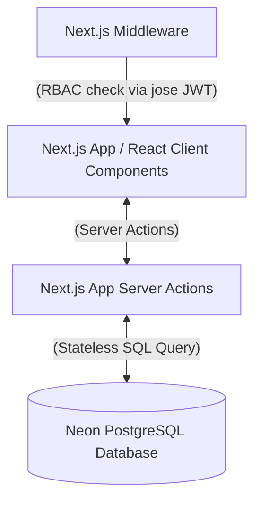

# InvFlow 📦

InvFlow is a premium, real-time inventory and quotation management system built using **Next.js**, a serverless **Neon-hosted PostgreSQL** database, and styled with **Tailwind CSS**. It supports high-precision decimal operations, multi-unit conversions (grams, kilograms, liters, milliliters, items), and Role-Based Access Control (RBAC) with secure session management.

---

## 🌟 Features

- **Robust RBAC Middleware**: Dynamic page guards protecting `/admin/*`, `/seller/*`, and `/buyer/*` routes, redirecting unauthenticated users to the login gate.
- **Dynamic Conversion Engine**: Order products in any compatible unit (e.g., purchase in grams while stored in kilograms), with real-time feedback on base equivalence and total costs.
- **Transactional Stock Control**: Atomically deducts inventory only when an Admin approves a pending quotation, using row-level locking (`FOR UPDATE`) to prevent race conditions.
- **High-Precision Decimals**: Native support for up to 4 decimal places for quantities and prices to accommodate wholesale and fine dimensions.
- **Seller-Isolate Catalogs**: Each seller manages their own distinct catalog and stock levels without cross-contamination.
- **Inline Custom Alerts**: No browser alert popups; features a premium glassmorphic toast notification system with slide-in animations.

---

## 🛠️ Tech Stack & High-Level System Design



### High-Level Interactions:
1. **Frontend (React 19)**: The Client Components handle state changes, cart operations, dynamic conversions, and theme toggling.
2. **Middleware Router Guard**: Prior to page load, Next.js Middleware inspects the encrypted JWT token stored in cookies via the `jose` library, ensuring users can only access their authorized role panels (`/admin`, `/seller`, `/buyer`).
3. **Backend Server Actions**: Business operations (such as `placeOrderAction` and `updateOrderStatusAction`) act as secure endpoints. They run server-side, retrieve the active user session, validate stock levels, and execute secure database queries.
4. **Neon Serverless PostgreSQL**: Relational database storage using `@neondatabase/serverless` with native connection pooling.
5. **Security & Hashing**: All user passwords are dynamically hashed and verified using **`bcryptjs`** (with a salt workload of 10) to guarantee secure credentials storage in the database.

---

## 📊 Database Schema

All numeric columns use PostgreSQL's **`NUMERIC(20, 4)`** to prevent floating-point rounding errors (e.g., `0.1 + 0.2 = 0.30000000000000004` under IEEE 754 standards).

### Tables Definition

```sql
-- 1. Users Table (Stores authentication records and account roles)
CREATE TABLE users (
  id SERIAL PRIMARY KEY,
  name VARCHAR(100) NOT NULL,
  email VARCHAR(150) UNIQUE NOT NULL,
  password_hash TEXT NOT NULL,
  role VARCHAR(20) NOT NULL DEFAULT 'buyer', -- 'admin', 'seller', or 'buyer'
  created_at TIMESTAMP WITH TIME ZONE DEFAULT CURRENT_TIMESTAMP
);

-- 2. Products Table (Stores individual items listed by sellers)
CREATE TABLE products (
  id SERIAL PRIMARY KEY,
  seller_id INT REFERENCES users(id) ON DELETE CASCADE, -- Owner of this listing
  name VARCHAR(150) NOT NULL,
  sku VARCHAR(50) UNIQUE NOT NULL,
  description TEXT,
  base_unit VARCHAR(10) NOT NULL, -- 'g', 'kg', 'L', 'mL', 'item'
  base_price NUMERIC(20, 4) NOT NULL, -- Price in INR per 1 base_unit
  inventory_qty NUMERIC(20, 4) NOT NULL DEFAULT 0.0000, -- Quantity available (in base_unit)
  created_at TIMESTAMP WITH TIME ZONE DEFAULT CURRENT_TIMESTAMP,
  updated_at TIMESTAMP WITH TIME ZONE DEFAULT CURRENT_TIMESTAMP
);

-- 3. Orders / Quotations Table (Stores order status headers)
CREATE TABLE orders (
  id SERIAL PRIMARY KEY,
  user_id INT NOT NULL REFERENCES users(id) ON DELETE CASCADE, -- Buyer placing the order
  status VARCHAR(20) NOT NULL DEFAULT 'pending', -- 'pending', 'approved', 'rejected'
  total_price NUMERIC(20, 4) NOT NULL,
  created_at TIMESTAMP WITH TIME ZONE DEFAULT CURRENT_TIMESTAMP,
  updated_at TIMESTAMP WITH TIME ZONE DEFAULT CURRENT_TIMESTAMP
);

-- 4. Order Items Table (Stores individual items within an order)
CREATE TABLE order_items (
  id SERIAL PRIMARY KEY,
  order_id INT NOT NULL REFERENCES orders(id) ON DELETE CASCADE,
  product_id INT NOT NULL REFERENCES products(id) ON DELETE CASCADE,
  ordered_qty NUMERIC(20, 4) NOT NULL, -- Quantity in chosen ordered_unit
  ordered_unit VARCHAR(10) NOT NULL, -- 'g', 'kg', 'L', 'mL', 'item'
  price_at_order NUMERIC(20, 4) NOT NULL, -- Converted rate per ordered_unit
  calculated_price NUMERIC(20, 4) NOT NULL, -- ordered_qty * price_at_order
  created_at TIMESTAMP WITH TIME ZONE DEFAULT CURRENT_TIMESTAMP
);
```

---

## ⚖️ Unit Storage & Conversion Strategy

The system structures physical dimensions as follows:
- **Weight**: `g` (reference unit, factor = 1) and `kg` (factor = 1000)
- **Volume**: `mL` (reference unit, factor = 1) and `L` (factor = 1000)
- **Count**: `item` (reference unit, factor = 1)

### 1. Storage & Precision Rules
*   **Base Quantities**: In-stock inventory (`inventory_qty`) is stored strictly in the product's `base_unit`.
*   **Decimals**: Quantities and prices are processed with high-precision decimals (`NUMERIC(20,4)`).
*   **Rounding**: Operations are rounded to 4 decimal places when updating database tables to align with stock tracking parameters.

### 2. Mathematical Formulas (`lib/units.ts`)
- **Quantity Conversion**:
  $$Q_B = Q_A \times \left( \frac{\text{factor}(Unit_A)}{\text{factor}(Unit_B)} \right)$$
  *Example (500 g Saffron to Base kg)*:
  $$Q_{\text{kg}} = 500 \times \left( \frac{1}{1000} \right) = 0.5000 \text{ kg}$$

- **Rate / Price Conversion**:
  $$\text{Price}_{\text{OrderUnit}} = \text{Price}_{\text{BaseUnit}} \times \left( \frac{\text{factor}(OrderUnit)}{\text{factor}(BaseUnit)} \right)$$
  *Example (Base price of ₹120 per kg converted to grams)*:
  $$\text{Price}_{\text{g}} = 120 \times \left( \frac{1}{1000} \right) = \text{₹0.1200 per gram}$$

---

## 🚀 Setup & Installation (Local Execution)

### 1. Install Dependencies
```bash
# Install packages
npm install
```

### 2. Configure Environment
Create a `.env` file in the root directory:
```env
DATABASE_URL="your-neon-postgres-connection-string"
JWT_SECRET="a-secure-random-string-at-least-32-chars-long"
```

### 3. Initialize Database
Run the setup script. This automatically creates tables, applies constraints, and seeds the predefined admin account (`admin@gmail.com` / `admin@1234`):
```bash
npm run db:setup
```

### 4. Run Locally
```bash
npm run dev
```
Open [http://localhost:3000](http://localhost:3000) in your browser.

---

## ☁️ Vercel Deployment Instructions

1. **Deploying via Vercel CLI**:
   Install Vercel CLI globally, then run deployment initialization:
   ```bash
   npm install -g vercel
   vercel login
   vercel
   ```
2. **Configure Environment Variables**:
   In the Vercel Project settings dashboard under **Environment Variables**, add:
   - `DATABASE_URL` (Neon PostgreSQL Connection String)
   - `JWT_SECRET` (Your JWT signature secret)
3. **Deploy Build**:
   ```bash
   vercel --prod
   ```

---

## 🔑 User Guide & Panel Walkthrough

### Predefined Admin Credentials
- **Email**: `admin@gmail.com`
- **Password**: `admin@1234`
*(To test Sellers and Buyers, click "Sign Up" on the homepage and create fresh accounts).*

### 👤 Buyer Panel (Purchase Desk)
*   **Browse Catalog**: View all products listed by different sellers, along with details showing who sells each product ("Sold by: [Seller Name]").
*   **Purchase Builder**: Add products to your cart and select custom purchase units (e.g. buying grams of rice instead of kilograms). The UI displays the effective conversion multiplier and subtotal live.
*   **Checkout**: Submit purchase request. Orders are initially flagged as `pending`.

### 🏢 Seller Panel (Catalog & Sales)
*   **Catalog CRUD**: Create new product items, edit names/descriptions/SKUs, configure base units, and adjust inventory levels when stock arrives.
*   **Isolated Catalog**: Sellers only see and edit products they added.
*   **Sales Ledger**: View orders containing their products with customer details and matching subtotals.

### 🛡️ Admin Panel (Audit & Command Center)
*   **System Catalog View**: View global inventory, base unit configurations, and who listed each product.
*   **Quotations Auditing**: Click on incoming orders to verify that conversion factors and calculated pricing are correct.
*   **Transactional Verification**: Approved orders run a transaction block that locks database rows, subtracts stock levels, and updates status to `approved`. Rejected orders modify status to `rejected` without changing inventory.
