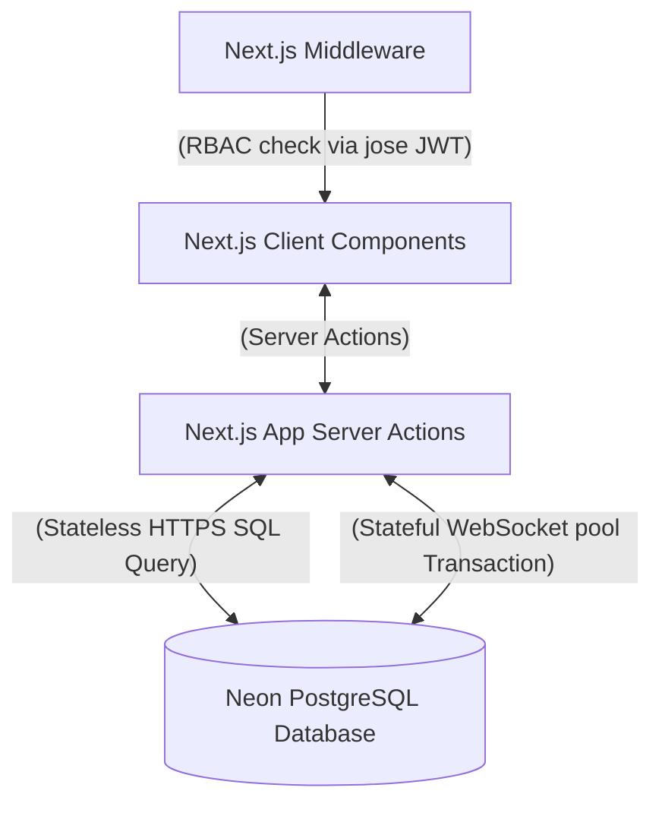

# InvFlow 📦

InvFlow is a premium, real-time inventory and quotation management system built using **Next.js**, a serverless **Neon-hosted PostgreSQL** database, and styled with **Tailwind CSS**. It supports high-precision decimal operations, multi-unit conversions (grams, kilograms, liters, milliliters, items), and Role-Based Access Control (RBAC) with secure session management.

---

## 🌟 Features

- **Robust RBAC Middleware**: Dynamic page guards protecting `/admin/*` and `/seller/*` routes, redirecting unauthenticated users to the auth gate.
- **Demo Mode Credentials**: Autocomplete toggles on the authentication screen for rapid evaluation.
- **Dynamic Conversion Engine**: Order products in any compatible unit (e.g. order saffron in grams while stored in kilograms), with real-time feedback on base equivalence and total costs.
- **Transactional Stock Control**: Atomically deducts inventory only when an Admin approves a pending quotation, using row-level locking (`FOR UPDATE`) to prevent race conditions.
- **High-Precision Decimals**: Support for up to 8 decimal places for quantities and prices to accommodate wholesale and fine chemical dimensions.
- **Interactive Dashboards**: Live catalog search, low stock alert flags, and transaction histories.

---

## 🛠️ Tech Stack & Architecture



### Stack Components:
1. **Frontend**: Next.js App Router (React 19 & Next.js 16) with Tailwind CSS. Styled using dark glassmorphism and subtle glows.
2. **Backend**: Next.js Server Actions and Middleware. Hashing is performed natively via Node.js `crypto` (PBKDF2), and session encryption is handled by `jose` (JWT).
3. **Database**: Neon serverless PostgreSQL, accessed via `@neondatabase/serverless` using stateless HTTP querying for page renders and WebSocket pools for transactional checkouts.

---

## 📊 Database Schema & Precision Strategy

All numeric columns use PostgreSQL's **`NUMERIC(20, 4)`**.
- **Why `NUMERIC`?** Standard floats/doubles (IEEE 754) suffer from floating-point rounding errors (e.g., `0.1 + 0.2 = 0.30000000000000004`). In financial transactions and fine-measure inventories, this is unacceptable.
- **Precision**: `NUMERIC(20, 4)` supports values up to `999,999,999,999,996.9999` (16 integer digits and 4 decimal digits). This handles tiny fractions (e.g. `0.0005 kg` of saffron) and massive quantities seamlessly.

### Tables definition:

```sql
-- Users Table
CREATE TABLE users (
  id SERIAL PRIMARY KEY,
  name VARCHAR(100) NOT NULL,
  email VARCHAR(150) UNIQUE NOT NULL,
  password_hash TEXT NOT NULL,
  role VARCHAR(20) NOT NULL DEFAULT 'seller', -- 'admin' or 'seller'
  created_at TIMESTAMP WITH TIME ZONE DEFAULT CURRENT_TIMESTAMP
);

-- Products Table
CREATE TABLE products (
  id SERIAL PRIMARY KEY,
  name VARCHAR(150) NOT NULL,
  sku VARCHAR(50) UNIQUE NOT NULL,
  description TEXT,
  base_unit VARCHAR(10) NOT NULL, -- 'g', 'kg', 'L', 'mL', 'item'
  base_price NUMERIC(20, 4) NOT NULL, -- Price in INR per 1 base_unit
  inventory_qty NUMERIC(20, 4) NOT NULL DEFAULT 0.0000, -- Amount in base_unit
  created_at TIMESTAMP WITH TIME ZONE DEFAULT CURRENT_TIMESTAMP,
  updated_at TIMESTAMP WITH TIME ZONE DEFAULT CURRENT_TIMESTAMP
);

-- Orders / Quotations Table
CREATE TABLE orders (
  id SERIAL PRIMARY KEY,
  user_id INT NOT NULL REFERENCES users(id) ON DELETE CASCADE,
  status VARCHAR(20) NOT NULL DEFAULT 'pending', -- 'pending', 'approved', 'rejected'
  total_price NUMERIC(20, 4) NOT NULL,
  created_at TIMESTAMP WITH TIME ZONE DEFAULT CURRENT_TIMESTAMP,
  updated_at TIMESTAMP WITH TIME ZONE DEFAULT CURRENT_TIMESTAMP
);

-- Order Items Table
CREATE TABLE order_items (
  id SERIAL PRIMARY KEY,
  order_id INT NOT NULL REFERENCES orders(id) ON DELETE CASCADE,
  product_id INT NOT NULL REFERENCES products(id) ON DELETE CASCADE,
  ordered_qty NUMERIC(20, 4) NOT NULL, -- Quantity in chosen unit
  ordered_unit VARCHAR(10) NOT NULL, -- 'g', 'kg', 'L', 'mL', 'item'
  price_at_order NUMERIC(20, 4) NOT NULL, -- Converted rate per ordered_unit
  calculated_price NUMERIC(20, 4) NOT NULL, -- ordered_qty * price_at_order
  created_at TIMESTAMP WITH TIME ZONE DEFAULT CURRENT_TIMESTAMP
);
```

---

## ⚖️ Unit Storage & Conversion Strategy

The system structures units into physical **dimensions**:
- **Weight**: `g` (reference unit, factor = 1) and `kg` (factor = 1000)
- **Volume**: `mL` (reference unit, factor = 1) and `L` (factor = 1000)
- **Count**: `item` (reference unit, factor = 1)

Units are only convertible within their respective dimensions. Attempting to cross dimensions (e.g. Basmati Rice in Liters) will trigger a system-level validation error.

### 1. Storage Rules
- Products are configured with a **`base_unit`** (e.g., `kg` for Rice, `g` for Saffron) and a **`base_price`** (INR cost per 1 `base_unit`).
- In-stock inventory `inventory_qty` is always saved in the product's `base_unit`.

### 2. Formulas Used (`lib/units.ts`)
- **Quantity Conversion**: To convert quantity $Q$ from $Unit_A$ to $Unit_B$:
  $$Q_B = Q_A \times \left( \frac{\text{factor}(Unit_A)}{\text{factor}(Unit_B)} \right)$$
  - *Example*: Convert 500 g Basmati Rice (Base: `kg`) to kg.
    $$Q_{\text{kg}} = 500 \times \left( \frac{1}{1000} \right) = 0.5 \text{ kg}$$

- **Rate Conversion**: To convert price $P$ (which is per $BaseUnit$) to price per $OrderUnit$:
  $$\text{Price}_{\text{OrderUnit}} = P \times \left( \frac{\text{factor}(OrderUnit)}{\text{factor}(BaseUnit)} \right)$$
  - *Example*: Saffron costs ₹350 per g (Base: `g`). Order unit is `kg`.
    $$\text{Price}_{\text{kg}} = 350 \times \left( \frac{1000}{1} \right) = \text{₹350,000 per kg}$$
  - *Example*: Basmati Rice costs ₹120 per kg (Base: `kg`). Order unit is `g`.
    $$\text{Price}_{\text{g}} = 120 \times \left( \frac{1}{1000} \right) = \text{₹0.12 per g}$$

### 3. Application Points
- **Client Side (Order Desk)**: Conversions are computed on-the-fly inside React state as the user enters amounts or toggles units. It displays the converted rate (e.g. ₹0.12/g) and equivalent base qty (e.g., 0.5 kg base) to demonstrate mathematical correctness.
- **Server Side (Place Order)**: Calculates totals based on conversion rules, avoiding client-tampering of prices.
- **Server Side (Approval)**: Converts the ordered quantity to `base_unit` to check against available inventory.

---

## 🚀 Setup & Installation (Local Execution)

### 1. Clone & Install Dependencies
```bash
# Clone the repository
git clone <repo-url>
cd my-app

# Install dependencies
npm install
```

### 2. Configure Database & Environment
Create a `.env` file in the root directory (based on `.env.example`):
```env
DATABASE_URL="your-neon-postgres-connection-string"
JWT_SECRET="a-secure-random-string-at-least-32-chars-long"
```

### 3. Initialize & Seed Database
We provide an automated script to build tables, set index constraints, hash default passwords, and seed mock inventory. Run:
```bash
npm run db:setup
```

### 4. Boot Dev Server
```bash
npm run dev
```
Open [http://localhost:3000](http://localhost:3000).

---

## 🔑 Test Credentials

Use these logins for evaluation, or create custom accounts using the **Sign Up** tab.

| Role | Email | Password | Catalog Permissions |
| :--- | :--- | :--- | :--- |
| **Admin** | `admin@inventory.com` | `admin123` | Create/edit/delete products, review order logs, approve/reject pending quotes |
| **Seller** | `seller@inventory.com` | `seller123` | Browse catalog, select units, build cart quotations, view order status history |

---

## ☁️ Vercel Deployment Instructions

1. **Deploying via Vercel CLI**:
   Install Vercel CLI globally if not already installed, then run the deployment setup:
   ```bash
   npm install -g vercel
   vercel login
   vercel
   ```
2. **Setting Environment Variables**:
   During the setup, Vercel will ask for environment variables. Ensure you configure:
   - `DATABASE_URL` (your Neon PostgreSQL URL)
   - `JWT_SECRET` (your JWT secret)
3. **Deploying Production**:
   ```bash
   vercel --prod
   ```
4. **GitHub Integration (Alternative)**:
   - Import your repository on the [Vercel Dashboard](https://vercel.com/new).
   - Enter your environment variables (`DATABASE_URL`, `JWT_SECRET`) in settings.
   - Deploy. Vercel will rebuild your app on every commit to the main branch.
